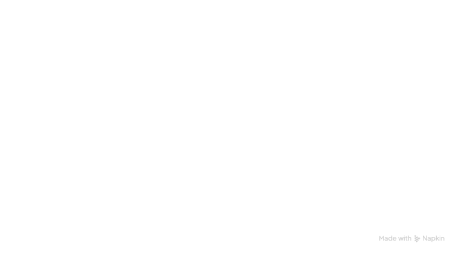

# Project: Improving Quantum Reservoir Computing

This project demonstrates a significant performance improvement in Quantum Reservoir Computing (QRC) by using an **entangled multi-reservoir architecture**. We show this approach is superior to baseline hybrid classical-quantum models for predicting complex, aperiodic time-series data.

---

## 1. The Challenge: Aperiodic Time-Series Prediction

The core task is to predict the future of a noisy, non-repeating signal generated by two damped harmonic oscillators. The baseline model (`Classical-Quantum-Reservoir-Computing.ipynb`) established that a hybrid classical-quantum approach (R² score of **0.595**) was promising but left room for improvement, as its quantum reservoirs were not correlated.

## 2. Our Solution: Entangled Multi-Reservoir Architecture

Our solution, detailed in `penny_oqrc.ipynb`, enhances the quantum component by directly entangling multiple quantum reservoirs. This allows the system to develop and leverage quantum correlations, creating a richer computational state from which to make predictions.

## 3. Architecture of the Entangled QRC

Our final, best-performing model follows the architecture below:

  
   
  <em>Entangled multi‑reservoir QRC with Pauli Z/ZZ measurements and Ridge (or Neural) readout.</em>

1.  **Input Encoding:** The classical input signal `x(t)` is encoded into the rotation angles of `RY` gates at the start of the circuit.
2.  **Entangled Reservoir:** The core of the model consists of multiple quantum sub-reservoirs. Crucially, `CNOT` gates are applied *between* these sub-reservoirs, creating a single, entangled quantum state.
3.  **State Measurement:** The state of the reservoir is extracted by measuring the expectation values of single- and two-qubit Pauli-Z operators, which form a classical feature vector.
4.  **Classical Readout:** A simple `Ridge` regression model maps this feature vector to the final prediction, `x(t+1)`.

## 4. Implementation & Framework Choices

The primary technical goal was to **leverage GPU acceleration**.

Our initial plan was to use **CUDA Quantum (`cudaq`)** for its direct, high-performance integration with NVIDIA GPUs. However, due to the time constraints of the challenge and our team being new to the `cudaq` framework, we were unable to produce a working implementation in time.

To still meet the objective, we pivoted to the next best alternative: **PennyLane's `lightning.gpu` backend**. This framework is well-documented and robust, and it allowed us to successfully utilize GPU resources to accelerate our experiments, thereby fulfilling the core requirement of the challenge.

## 5. Findings and Improvement

Our experiments show the entangled architecture is superior.

| Model Architecture | Framework | R² Score |
| :--- | :--- | :--- |
| Hybrid Classical-Quantum (Baseline) | Qiskit | **0.595** |
| Independent Reservoirs | PennyLane | 0.465 |
| Channel Coupled Reservoirs | PennyLane | 0.608 |
| **Entangled Reservoirs (Our Solution)** | **PennyLane** | **0.672** |

The entangled model's R² score of **0.672** is a significant improvement over the baseline, confirming that quantum correlations are a powerful resource for this task.

## 6. Further Experiments: Neural Readouts

We also explored if a more advanced classical readout could further improve performance. In `jit.ipynb`, we replaced the simple Ridge regression with a **PyTorch-based neural network**. Our hypothesis was that a neural network could capture more complex, non-linear patterns from the reservoir's state.

The experiment, however, showed that the neural network performed significantly worse than the simpler Ridge model on this task. This is a valuable insight: in a low-data regime, a more complex model can be prone to overfitting, making the robust, regularized linear model the superior choice.

### Related Work

Our approach is consistent with existing research into hybrid quantum-classical reservoir computing.

- **arXiv:2508.11175 - "Role of Entanglement in QRC with Coupled Kerr Oscillators"**: This paper finds that creating entanglement between coupled reservoirs leads to a computational advantage and improves time-series prediction.

- **arXiv:2201.07969 - "Two Quantum Reservoirs via Optimized Measurements"**: This work demonstrates the resource efficiency of entanglement, showing that a 7-qubit entangled reservoir can match the performance of a 25-qubit classically-connected system.

The use of a classical neural network to process the quantum state's measurement outcomes is also a recognized technique.

- **R. Martinez-Pena, et al. (2021)**, in "Quantum reservoir computing with a single qubit" (Physical Review A, 103, 052417), demonstrate a QRC where a feed-forward neural network is used as the classical readout layer for processing the qubit measurements.

- **J. Angel-Hurtado, et al. (2024)**, in "Dynamical learning of a chaotic time series using a quantum reservoir computer" (Physical Review E, 109, 044211), also apply a classical post-processing layer to the reservoir's outputs to perform time-series prediction, validating this hybrid architectural pattern.

## 7. Conclusion

For this time-series prediction challenge, our work confirms that an **entangled quantum reservoir is a more effective architecture** than simply combining independent quantum and classical systems. Furthermore, we found that this sophisticated quantum model pairs best with a **simple and robust classical readout** to achieve optimal performance.

---

## Acknowledgements

I would like to express my gratitude to the qBraid team for organizing this fun and educational challenge. It provided a valuable opportunity to explore powerful new frameworks like CUDA Quantum, Catalyst, and JAX/JIT for the first time. This experience has been a significant learning journey into the world of accelerated and hybrid quantum computing.
